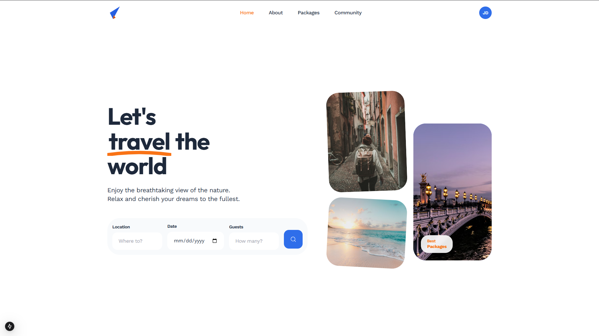

<div align="center">
<a href="https://github.com/fahmirizalbudi/travelto" target="blank">

</a>
<br/>

<br />
<br />


</div>

<br />

## Travelto

Travelto is a modern travel booking platform built with Next.js 15 and React 19. It provides a seamless experience for discovering and booking travel packages with a beautiful, responsive interface.

Key features include:

- Browse curated travel packages
- User authentication and profile management
- Order history tracking
- Community posts and interactions
- Responsive design for all devices

## Preview



## Features

- **Server-Side Rendering:** Optimized SSR/CSR balance for better performance and SEO.
- **Modern UI/UX:** Clean and aesthetic design with smooth transitions and animations.
- **Type-Safe:** Built with TypeScript in strict mode for reliability.
- **Fast Development:** Powered by Turbopack for instant Hot Module Replacement.

## Tech Stack

- **Next.js 15**: React framework with App Router for full-stack web applications.
- **React 19**: Latest React version with improved performance and features.
- **TypeScript**: Strongly typed JavaScript for better developer experience.
- **Tailwind CSS 3.4**: Utility-first CSS framework for rapid UI development.
- **Hugeicons React**: Beautiful icon library for consistent iconography.

## Getting Started

To get a local copy of this project up and running, follow these steps.

### Prerequisites

- **Node.js** (v18 or higher) & **NPM**.

## Installation

1. **Clone the repository:**

   ```bash
   git clone https://github.com/fahmirizalbudi/travelto.git
   cd travelto
   ```

2. **Install dependencies:**

   ```bash
   npm install
   ```

3. **Start the development server:**

   ```bash
   npm run dev
   ```

## Usage

### Running the Application

- **Development mode:** `npm run dev` (with Turbopack).
- **Production build:** `npm run build`.
- **Start production:** `npm run start`.
- **Lint code:** `npm run lint`.

> Open [http://localhost:3000](http://localhost:3000) to view it in the browser.


## License

All rights reserved. This project is for educational purposes only and cannot be used or distributed without permission.
